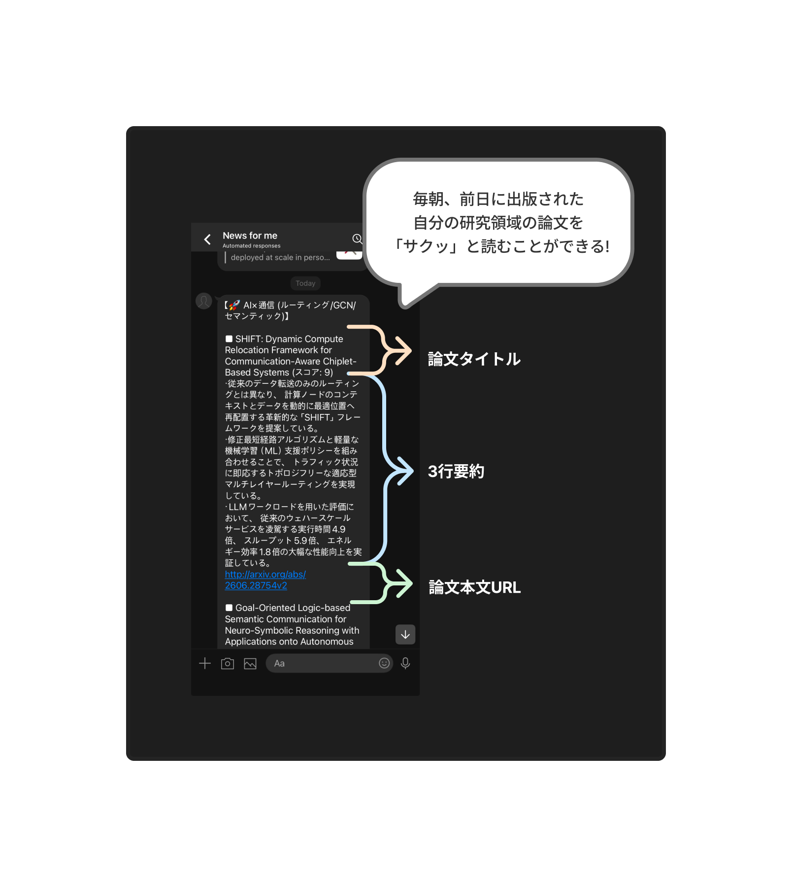

# NewsAI (Daily AI Research Agent)

最新の学術論文（arXiv）から特定のテーマに関する研究を毎朝自動で収集・評価・要約し、LINEへ配信するパーソナルAIエージェントです。

### 1.機能 (Features)

- 論文の自動収集: arXiv APIを活用し、前日にパブリッシュされた最新論文を取得。

- LLMによるスコアリング＆3行要約: Gemini API (gemini-3.5-flash) を用い、論文の新規性や実用性を独自の評価基準で採点し、要点を3行の箇条書きで分かりやすく要約。

- LINEへの自動配信: LINE Messaging APIを使用し、毎朝指定した時間に要約付きのニュースをプッシュ通知。

- 完全自動化: GitHub Actionsのcron機能により、サーバーレスで毎朝7時（JST）に定期実行。

### 2.ターゲット領域 (Research Topics)

本エージェントは、以下の特定ドメインにおける最新研究を重点的にトラッキングします。

- AI × 通信: ルーティング最適化、V2X、セマンティック通信、Knowledge Graph (KG) や Graph Convolutional Network (GCN) を用いた通信フレームワーク

- AIの学習・研究活用: LLMの推論、リサーチアシスタント、教育へのAI活用

- AI × 心理学: 認知科学とAIの交差点、独自性と面白さのある研究

### 3.技術スタック (Tech Stack)

- 言語: Python 3

- 主要ライブラリ: arxiv, google-generativeai, requests, python-dotenv

- インフラ/自動化: GitHub Actions

- 外部API: Google Gemini API, LINE Messaging API

### 4.ローカル環境での実行方法 (Local Setup)

##### 4.1.リポジトリのクローン

`git clone `
`cd newsai`


##### 4.2.依存関係のインストール

`pip install -r requirements.txt`


##### 4.3.環境変数の設定
プロジェクトのルートディレクトリに .env ファイルを作成し、以下のAPIキーを設定します。

`GEMINI_API_KEY=your_gemini_api_key`
`LINE_ACCESS_TOKEN=your_line_access_token`
`LINE_USER_ID=your_line_user_id`


##### 4.4.スクリプトの実行

`python3 main.py`


### 5.GitHub Actions での自動化設定 (Deployment)

GitHubリポジトリの Settings > Secrets and variables > Actions にて、以下のRepository Secretsを登録します。

`GEMINI_API_KEY`

`LINE_ACCESS_TOKEN`

`LINE_USER_ID`

設定完了後、.github/workflows/daily_agent.yml のスケジュールに基づき、毎日UTC 22:00（日本時間 午前7:00）に自動実行されます。Actionsタブから `workflow_dispatch` を用いた手動実行も可能です。

### 6. Demo


### 7.ディレクトリ構成 (Project Structure)

```
newsai/ 
 ├── .github/
 │    └── workflows/
 │         └── daily_agent.yml  # GitHub Actionsの設定ファイル
 ├──images/
 │     └──demo.jpg              # デモ画像
 ├── .env                       # 環境変数（Git管理外）
 ├── .gitignore                 # Git除外設定
 ├── main.py                    # 論文取得・要約・送信を行うメインスクリプト
 └── requirements.txt           # 依存パッケージ一覧
```

### 8. 今後の展望　(Future Work)
#### 8.1. パーソナル・ナレッジグラフ（PKG）の構築とGCNによる推薦

- 概要: 毎日取得・要約した論文データから、「タスク」「提案手法」「データセット」などのエンティティを抽出し、知識グラフ（Knowledge Graph）としてデータベースに蓄積する。

- 発展: 蓄積されたグラフデータに対し、Graph Convolutional Network (GCN) などのグラフニューラルネットワークを適用することで、「ユーザーが過去に高く評価した論文群」の構造と類似する、未知の画期的な論文を高精度で予測・推薦するシステムへと改良させる。

#### 8.2. RAG (検索拡張生成) を用いた「対話型論文アシスタント」への進化

- 概要: 過去にLINEに送信した論文の要約やテキストをベクトルデータベース化し、ユーザーがいつでも検索・引き出しできるようにする。

- 機能例: LINE上で「先週のV2X関連の論文で、一番遅延削減に効果的だった手法は何だっけ？」と質問すると、蓄積された過去のニュースから該当する情報を探し出し、自然言語で回答してくれる対話インターフェースの実装。

#### 8.3. セマンティック要約とトークン最適化

- 概要: ただ要約するだけでなく、情報伝達の効率化という観点からプロンプトをチューニングし、より少ないトークン数でユーザーの目的に合致した「意味」だけを抽出・圧縮して伝送するアーキテクチャの探求。限られたAPI枠の中で、より多くの論文を処理するための最適化を図る。